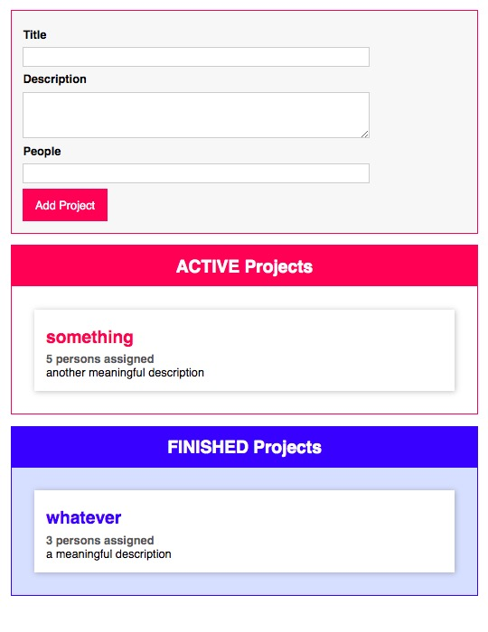

## TypeScript: https://www.typescriptlang.org/
- checking at compile time, not just runtime!
----
Basic Setup:
```
tsc --init
```
#### tsconfig.json - compilation options e.g. strict
https://www.typescriptlang.org/docs/handbook/tsconfig-json.html
Add:
```json
"outDir": "dist",
"sourceMap": true
```

```
npm start
<!-- watch mode -->
tsc -w
```
----
With Webpack:
```html
<script src="dist/bundle.js" defer></script>
```
---
Map Search with OpenCage Geocoder API: https://opencagedata.com/

---
Basic Drag and Drop: https://developer.mozilla.org/en-US/docs/Web/API/HTML_Drag_and_Drop_API

